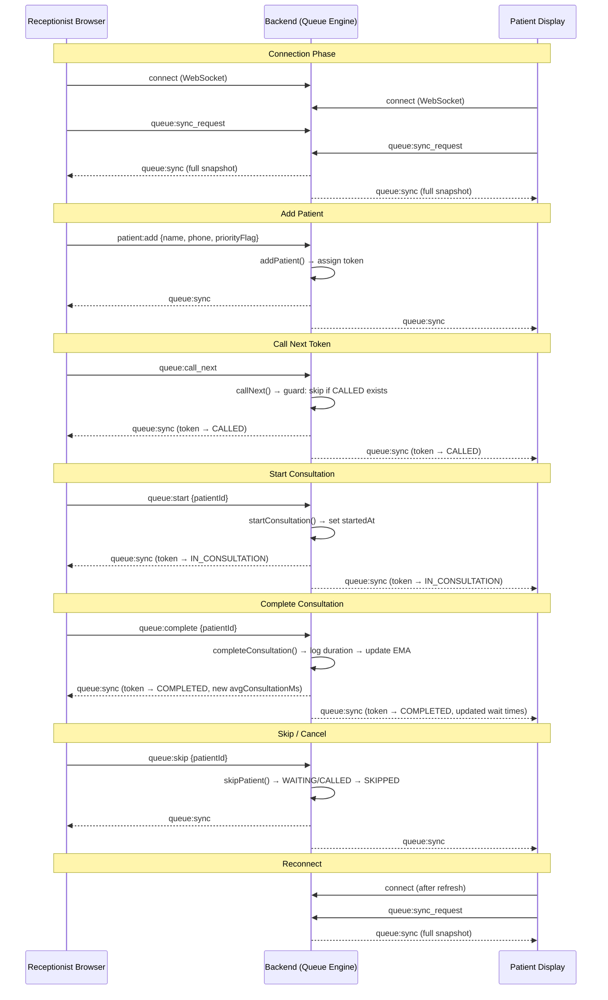

# Socket Events Diagram

Copy the Mermaid code below into [mermaid.live](https://mermaid.live),
then export as PNG → save as `socket-events-diagram.png` in this folder.

```mermaid
sequenceDiagram
    participant R as Receptionist Browser
    participant S as Backend (Queue Engine)
    participant P as Patient Display

    Note over R,P: Connection Phase
    R->>S: connect (WebSocket)
    P->>S: connect (WebSocket)
    R->>S: queue:sync_request
    P->>S: queue:sync_request
    S-->>R: queue:sync (full snapshot)
    S-->>P: queue:sync (full snapshot)

    Note over R,P: Add Patient
    R->>S: patient:add {name, phone, priorityFlag}
    S->>S: addPatient() → assign token
    S-->>R: queue:sync
    S-->>P: queue:sync

    Note over R,P: Call Next Token
    R->>S: queue:call_next
    S->>S: callNext() → guard: skip if CALLED exists
    S-->>R: queue:sync (token → CALLED)
    S-->>P: queue:sync (token → CALLED)

    Note over R,P: Start Consultation
    R->>S: queue:start {patientId}
    S->>S: startConsultation() → set startedAt
    S-->>R: queue:sync (token → IN_CONSULTATION)
    S-->>P: queue:sync (token → IN_CONSULTATION)

    Note over R,P: Complete Consultation
    R->>S: queue:complete {patientId}
    S->>S: completeConsultation() → log duration → update EMA
    S-->>R: queue:sync (token → COMPLETED, new avgConsultationMs)
    S-->>P: queue:sync (token → COMPLETED, updated wait times)

    Note over R,P: Skip / Cancel
    R->>S: queue:skip {patientId}
    S->>S: skipPatient() → WAITING/CALLED → SKIPPED
    S-->>R: queue:sync
    S-->>P: queue:sync

    Note over R,P: Reconnect
    P->>S: connect (after refresh)
    P->>S: queue:sync_request
    S-->>P: queue:sync (full snapshot)
```